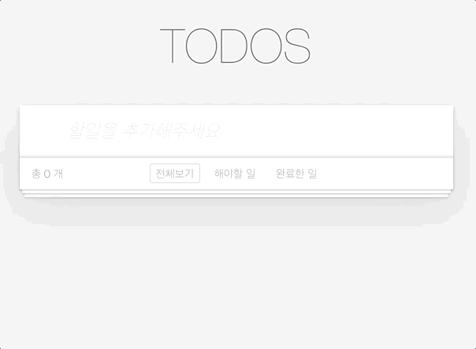
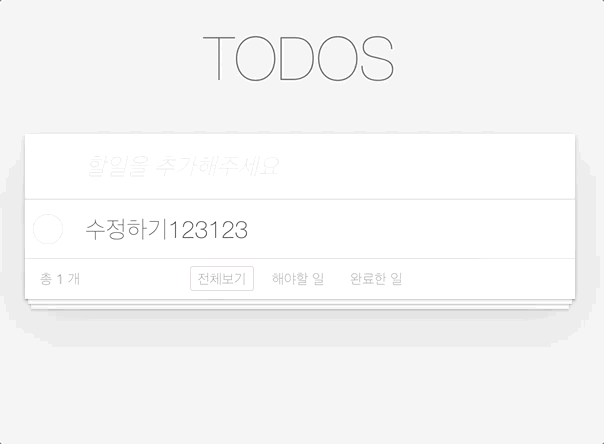
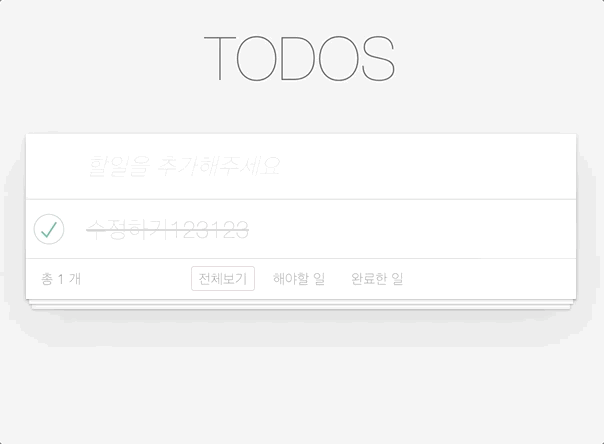

<p align="middle" >
  
</p>
<h2 align="middle">Clean JS TODO</h2>
<p align="middle">자바스크립트 클린 코드로 구현 하는 투두리스트</p>

<div align="middle">
<a href="https://yujo11.github.io/js-todo-list-step1-1/" target="_blank"> 🖥 데모 사이트 </a>
</div>

## 🎯 요구사항

### 🚀 STEP 01

<div align="middle">
  
</div>

<br />

- [x] Todo List에 Item을 키보드로 입력하여 추가하기
- [ ] Todo List의 x버튼을 이용해서 해당 엘리먼트를 삭제하기

---

### 🚀🚀 STEP 02

<div align="middle">
  
</div>

<br />

- [ ] Todo List에 Item을 더블 클릭하여 수정하기
- [ ] Todo List를 더블클릭했을 때 input 모드로 변경 (li tag 에 editing class 추가) 단 이때 수정을 완료하지 않은 상태에서 esc키를 누르면 수정되지 않은 채로 다시 view 모드로 복귀
- [ ] Todo List의 item갯수를 count한 갯수를 리스트의 하단에 보여주기

---

### 🚀🚀🚀 STEP 03

<div align="middle">
  
</div>

<br />

- [ ] Todo List의 체크박스를 클릭하여 complete 상태로 변경 (li tag 에 completed class 추가, input 태그에 checked 속성 추가)
- [ ] todo list의 상태값을 확인하여, 해야할 일과, 완료한 일을 클릭하면 해당 상태의 아이템만 보여주기

---

### 🚀🚀🚀🚀 STEP 04

<div align="middle">
  
</div>

<br />

- [ ] localStorage에 데이터를 저장하여, TodoItem의 CRUD를 반영하기. 따라서 새로고침하여도 저장된 데이터를 확인할 수 있어야 함

---

<br/>

## 🔔 참고사항

`TodoItem`을 추가할 시 아래 템플릿을 활용하면 됩니다.

```html
<ul id="todo-list" class="todo-list">
  <li>
    <div class="view">
      <input class="toggle" type="checkbox" />
      <label class="label">새로운 타이틀</label>
      <button class="destroy"></button>
    </div>
    <input class="edit" value="새로운 타이틀" />
  </li>
  <li class="editing">
    <div class="view">
      <input class="toggle" type="checkbox" />
      <label class="label">완료된 타이틀</label>
      <button class="destroy"></button>
    </div>
    <input class="edit" value="완료된 타이틀" />
  </li>
  <li class="completed">
    <div class="view">
      <input class="toggle" type="checkbox" checked />
      <label class="label">완료된 타이틀</label>
      <button class="destroy"></button>
    </div>
    <input class="edit" value="완료된 타이틀" />
  </li>
</ul>
```

<br/>

## 📝 License

This project is [MIT](https://github.com/next-step/js-todo-list-step1/blob/main/LICENSE) licensed.
